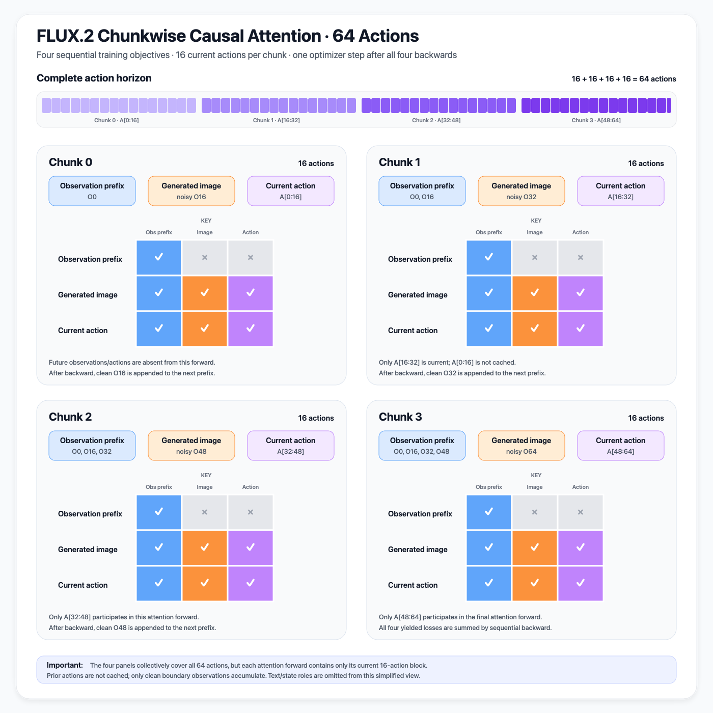

# FLUX.2 Chunkwise Causal Training 구현 가이드

이 문서는 DreamZero의 chunkwise causal training 개념을 ImageWAM FLUX.2 학습 경로에 적용할 때 필요한 주요 구현 지점을 정리한다. 기본값은 `K=4`, chunk당 action horizon은 기존과 동일한 `16`이며, 네 chunk는 서로 독립된 비디오가 아니라 **하나의 64-action video trajectory를 시간순으로 나눈 구간**이다.

## 1. 목표 동작

기본 65-frame/64-transition sample은 다음과 같이 구성한다.

```text
O0 -- A[0:16] --> O16 -- A[16:32] --> O32 -- A[32:48] --> O48 -- A[48:64] --> O64
```

| Chunk | Clean observation prefix | Noisy target | Action slice | State anchor |
|---|---|---|---|---|
| 0 | `O0` | `O16` | `action[0:16]` | `state[0]` |
| 1 | `O0, O16` | `O32` | `action[16:32]` | `state[16]` |
| 2 | `O0, O16, O32` | `O48` | `action[32:48]` | `state[32]` |
| 3 | `O0, O16, O32, O48` | `O64` | `action[48:64]` | `state[48]` |

Chunk `i`가 끝나면 ground-truth target `O(i+1)`을 다음 chunk의 clean prefix에 추가한다. 따라서 학습은 teacher forcing이며, 생성된 observation을 다시 입력하는 rollout 학습은 이번 범위에 포함하지 않는다.

### 핵심 제약

```text
num_observation_anchors == K + 1
actions_per_chunk == 16
action_horizon == K * actions_per_chunk
num_frames == action_horizon + 1
proprio_horizon >= action_horizon
all ranks yield exactly K losses
```

- Cache는 한 collated batch의 한 generator 호출 동안만 존재한다.
- Cache에는 frozen VAE가 만든 clean observation token/ID만 저장한다.
- FLUX layer K/V cache는 사용하지 않는다.
- Cache는 parameter, buffer, checkpoint, `state_dict`에 포함하지 않는다.
- `K=1` 또는 chunkwise disabled 상태는 기존 FLUX loss 경로를 그대로 사용한다.

## 2. 주요 코드 변경 지점

### 2.1 Dataset: observation boundary 추출

대상:

- `src/imagewam/datasets/lerobot/robot_video_dataset.py`

구현:

1. `observation_chunk_count` 옵션을 추가한다.
2. `actions_per_chunk` 옵션을 추가하고 기본값을 기존 action horizon과 같은 `16`으로 둔다.
3. 활성화되면 다음 식으로 `K+1`개 observation index를 계산한다.

   ```python
   total_action_horizon = K * actions_per_chunk
   num_frames = total_action_horizon + 1
   image_obs_indices = [i * actions_per_chunk for i in range(K + 1)]
   ```

4. `K=4, actions_per_chunk=16`이면 65-frame/64-action window와 `[0, 16, 32, 48, 64]`를 반환한다.
5. 명시된 `num_frames` 또는 action horizon이 위 식과 다르면 자동 보정하지 않고 즉시 실패시킨다.
6. 기존 action/state timestamp와 episode-edge padding 의미는 유지한다.
7. Processor의 `image_obs_steps`가 `K+1`인지 preprocessing 이전에 설정·검증한다.

Dataset 객체가 sample 간 cache를 가지면 안 된다. Distributed sampler가 sample 순서를 바꾸므로 이전 `__getitem__` 결과를 다음 sample history로 재사용할 수 없다.

### 2.2 FLUX 전용 data config

공유 pair config는 OmniGen2/Ovis/CacheIDM에서도 사용하므로 직접 수정하지 않는다. 다음 FLUX 전용 overlay를 추가한다.

- `configs/data/libero_flux2_chunkwise.yaml`
- `configs/data/robotwin_flux2_chunkwise.yaml`
- `configs/data/robotwin_flux2_clean_chunkwise.yaml`
- `configs/data/interndata_a1_ee_v3_flux2_chunkwise.yaml`

각 overlay는 기존 pair config를 상속하고 다음 값을 사용한다.

```yaml
num_frames: null  # chunkwise dataset derives K * actions_per_chunk + 1
observation_chunk_count: ${model.chunkwise_causal.num_chunks}
chunkwise_causal_enabled: ${model.chunkwise_causal.enabled}
actions_per_chunk: ${model.chunkwise_causal.actions_per_chunk}
```

FLUX task config만 이 overlay를 선택해야 한다. Non-FLUX task composition은 기존과 동일해야 한다.

### 2.3 Model config와 runtime plumbing

대상:

- `configs/model/imagewam_flux2_klein_4b_base.yaml`
- FLUX.2 Klein 9B model config
- `src/imagewam/runtime.py::create_imagewam_flux2_klein`
- `src/imagewam/models/backbones/imagewam.py::from_flux2_klein_pretrained`

기본 config:

```yaml
chunkwise_causal:
  enabled: true
  num_chunks: 4
  actions_per_chunk: 16
  loss_reduction: mean
  cache_type: observation_prefix
```

`model.chunkwise_causal.num_chunks`와 `actions_per_chunk`를 trajectory geometry의 source of truth로 사용한다. Dataset이 방출한 observation 수, total action horizon 또는 model geometry가 다르면 forward 전에 실패시킨다. `enabled=false` 또는 명시적 `K=1` override는 model과 FLUX dataset 모두에서 기존 17-frame/16-action endpoint-pair geometry를 복원해야 한다.

Dispatch 규칙:

```text
FLUX + enabled + K > 1  -> sequential chunkwise iterator
FLUX + disabled/K == 1 -> existing _training_loss_flux2
non-FLUX               -> existing training_loss
non-FLUX + K > 1       -> explicit configuration error
```

### 2.4 Multi-observation FLUX input builder

대상:

- `src/imagewam/models/backbones/imagewam.py::build_inputs_flux2`
- `src/imagewam/models/backbones/imagewam.py::_append_proprio_to_context`
- `src/imagewam/models/backbones/flux2_video_expert.py`

기존 endpoint-pair 전용 처리를 재사용 가능한 helper로 분리한다.

반환해야 할 정보:

- VAE-encoded observation entries `O0 ... OK`
- 각 observation의 token length와 ordered image ID
- `K`개의 action slice와 padding mask
- 각 chunk의 proprio/state anchor
- batch item별 실제 proprio token position
- physical FLUX sequence의 role별 offset

`pack_proprio_after_text=True`이면 proprio 위치가 sample의 valid text length에 따라 달라진다. 하나의 batch-global state offset을 attention mask에 사용하면 안 된다.

Clean observation ID는 기존 clean/noisy role 범위를 유지하면서 `ids[..., 0]`에 단조 증가하는 chunk ordinal을 포함해야 한다. 4B와 9B token shape 모두에서 observation ID가 서로 구분되어야 한다.

## 3. Chunkwise causal attention mask

대상:

- `src/imagewam/models/backbones/imagewam.py`의 기존 FLUX mask builder 인접 위치

기존 `K=1` mask builder는 수정하지 않고 chunkwise 전용 pure helper를 추가한다. `double_joint`와 `single` mask는 동일한 causal relation을 가져야 하지만 서로 독립된 tensor여야 한다.

### 3.1 Observation / generated image / action 시각화

아래 그림은 네 번의 sequential attention forward 전체를 나타낸다. 각 chunk는 기존과 동일한 16-action block을 가지며, 네 panel이 합쳐서 `A[0:64]` 총 64개 action을 모두 포함한다. 각 개별 forward에는 현재 16개 action만 존재하고 이전 action은 cache하지 않으며, clean boundary observation만 누적된다.



Chunk `i`에서 허용되는 attention 관계:

| Query | 볼 수 있는 Key |
|---|---|
| Valid instruction | valid instruction |
| Clean `Oj` | valid instruction + `O0 ... Oj` |
| Noisy target `O(i+1)` | valid instruction + `O0 ... Oi` + current target/state |
| Current action `Ai` | valid instruction + `O0 ... Oi` + current action/state |
| Current state `Si` | 자기 자신 |

Future observation/action은 mask로만 숨기지 말고 chunk 입력 tensor에서 물리적으로 제외한다.

```text
Chunk i input:
  present: O0 ... Oi, noisy O(i+1), Ai, Si
  absent:  O(i+2) ... OK, A(i+1) ... A(K-1)
```

Mask 생성 전 다음을 검증한다.

- role offset이 음수가 아니고 sequence 범위 안에 있는가
- role 구간이 겹치지 않는가
- role별 길이 합이 실제 MoT sequence length와 같은가
- 모든 padding key가 모든 query에서 차단되는가
- sample별 proprio 위치가 실제 packed 위치와 같은가

## 4. Prepared-model chunk forward contract

대상:

- `src/imagewam/models/backbones/imagewam.py`
- frozen shared preparation: `prepare_chunkwise_training_inputs(sample)`
- canonical trainable forward: `model(prepared_chunkwise_inputs=prepared, chunk_index=i)`

`sequential` reference 동작:

```python
prepared = unwrapped_model.prepare_chunkwise_training_inputs(sample)

for i in range(K):
    loss_i, metrics_i = prepared_model(
        prepared_chunkwise_inputs=prepared,
        chunk_index=i,
    )
    accelerator.backward(loss_i)
```

`unwrapped_model`에서 실행해도 되는 것은 `torch.no_grad()` frozen VAE/text preparation뿐이다. Trainable FLUX projection, proprio encoder, MoT, loss는 반드시 `Accelerator.prepare`가 반환한 바깥 `prepared_model(...)` 호출 안에서 실행한다. 따라서 DDP/DeepSpeed의 forward lifecycle과 gradient reducer를 우회하지 않는다. `training_loss(sample)`은 K>1에서 legacy endpoint objective로 조용히 fallback하지 않고 실패해야 한다.

`packed_flex`는 동일한 `prepared` payload와 diffusion draw 순서를 사용하지만 wrapper 호출을 하나로 합친다.

```python
prepared = unwrapped_model.prepare_chunkwise_training_inputs(sample)
loss, metrics = prepared_model(prepared_chunkwise_inputs=prepared)
accelerator.backward(loss)
```

현재 선택된 packing은 DreamZero-style `interleaved`다. 각 chunk는 독립적인 diffusion timestep/AdaLN conditioning으로 Q/K/V를 만든 뒤 sequence 축으로 합쳐지고, 모든 MoT layer는 ImageWAM 소유 `PackedBlockSparseMask`를 통해 한 번 호출된다. Chunk `i`의 noisy target과 action은 canonical instruction과 clean observation `O0..Oi`를 공유하지만, ImageWAM 방식대로 target-image noise와 action noise 사이의 직접 edge는 양방향 차단한다. 각 modality는 자신의 current block과 state만 볼 수 있다. Clean `Oi`는 instruction과 `O0..Oi`에만 접근하고 state query는 self-only다. 중복 prefix token은 physical segment에는 남지만 dynamic validity가 canonical key만 선택한다. Cached topology는 structural layout만 보유하고, 현재 batch의 query/key validity와 chunk별 state position은 매 forward immutable snapshot으로 전달한다. Production packed path는 dense `[B,L,L]` mask를 만들지 않는다.

| Mode | Outer forward / logical microbatch | Backward | 용도 |
|---|---:|---:|---|
| `sequential` | `K` | `K` | 기본값, parity oracle, rollback |
| `packed_flex` | `1` | `1` | CUDA + FlexAttention opt-in |

명시적으로 `packed_flex`를 요청했는데 CUDA, PyTorch FlexAttention, FLUX.2, K>1, 지원 distributed backend 조건이 충족되지 않으면 자동 fallback하지 않고 시작 시 실패한다.

### Exact objective

각 sample `b`에 대해 chunk loop 전에 전체 window denominator를 계산한다.

```text
Dv_b = max(sum_i valid_target[b,i] * num_target_elements, 1)
Da_b = max(sum_i count(valid_action_elements[b,i]), 1)
```

Chunk contribution:

```text
L_i = mean_b(
  lambda_video * valid_target[b,i] * video_weight[b,i]
               * sum(video_squared_error[b,i]) / Dv_b
  +
  lambda_action * action_weight[b,i]
                * sum(valid action squared error[b,i]) / Da_b
)
```

최종 logical batch objective는 다음과 같다.

```text
L = sum_i L_i
```

모든 chunk가 동일 크기이고 padding이 없을 때만 각 contribution이 직관적인 `1/K` 비중으로 축약된다. Mixed padding에서는 chunk별 단순 평균을 사용하면 안 된다.

## 5. Trainer 통합

대상:

- `src/imagewam/trainer.py`의 training step
- `src/imagewam/trainer.py`의 validation loss aggregation

`sequential` logical batch의 순서:

```text
zero_grad / accumulation context 시작
  frozen shared input preparation 한 번
  prepared_model chunk 0 forward -> backward(L0)
  prepared_model chunk 1 forward -> backward(L1)
  prepared_model chunk 2 forward -> backward(L2)
  prepared_model chunk 3 forward -> backward(L3)
optimizer.step 한 번
```

`packed_flex` logical batch의 순서:

```text
zero_grad / accumulation context 시작
  frozen shared input preparation 한 번
  prepared_model packed forward 한 번 -> aggregate L = sum_i L_i
  backward(L) 한 번
optimizer.step 한 번
```

- `retain_graph=True`를 사용하지 않는다.
- Outer gradient accumulation 정책은 기존 trainer가 관리한다.
- 모든 rank는 동일한 mode를 사용하고 `sequential`이면 정확히 `K`번, `packed_flex`이면 정확히 한 번 backward 해야 한다.
- 모든 trainable chunk forward는 unwrapped module이 아니라 동일한 prepared wrapper를 통과해야 한다.
- Multi-process인데 `Accelerator.prepare` 결과가 실제 wrapper가 아니면 시작 시 실패한다.
- Frozen preparation을 engine 밖에서 실행하는 안전성이 검증되지 않은 ZeRO-3는 시작 시 거부한다. 현재 지원 범위는 DDP와 ZeRO 0-2다.
- Sequential에서 한 chunk가 완전히 padded여도 생략하지 말고 differentiable zero anchor를 yield한다.
- Packed에서 fully padded contribution도 aggregate graph 안에 differentiable zero로 남긴다.
- Metric은 마지막 chunk 값으로 덮어쓰지 않고 모든 chunk를 합산한다.
- Validation도 persistent cache 없이 모든 `K` contribution을 합산한다.

권장 metric:

- `loss_video`
- `loss_action`
- `chunk_count`
- `chunk/{i}/loss_video`
- `chunk/{i}/loss_action`
- observation prefix token count
- total attention sequence length

## 6. Checkpoint와 resume

새 full trainer-state에는 다음 metadata를 저장한다.

- `resolved_chunk_count`
- `resolved_actions_per_chunk`
- `resolved_total_action_horizon`
- `chunkwise_enabled`
- `cache_type`
- `forward_mode`
- `sparse_packing`
- `sparse_block_size`
- `sparse_alignment`
- `packed_layout_schema_version`
- PyTorch major/minor

Resume 정책:

| Checkpoint 형태 | 허용 동작 |
|---|---|
| Weights-only | 현재 명시적 config의 `K`로 로드 |
| 새 full-state, 동일 `K`/actions-per-chunk/capability | 정상 resume |
| 새 full-state, 변경된 `K`/actions-per-chunk/cache type | 실패 |
| Legacy full-state, `K=1` | legacy mode resume |
| Metadata-less legacy full-state, resolved `K>1` | optimizer state resume 금지; weights부터 재시작 |

Observation-prefix cache tensor는 checkpoint에 저장하지 않는다.

## 7. 테스트 구현 지점

관련 first-party tests:

```text
tests/test_chunkwise_dataset_config.py
tests/test_flux2_chunkwise.py
tests/test_flux2_chunkwise_model.py
tests/test_mot_packed_attention.py
tests/test_trainer_chunk_objectives.py
tests/test_flux2_chunkwise_benchmark.py
```

필수 검증:

1. `K=4, actions_per_chunk=16 -> 65 frames, 64 actions, [0,16,32,48,64]`.
2. Prefix length가 `[1,2,3,4]`로 증가한다.
3. Future observation/action을 변경해도 earlier chunk loss가 변하지 않는다.
4. `O0`을 변경하면 later chunk loss가 변한다.
5. `double_joint`와 `single` mask가 causal oracle과 일치한다.
6. 서로 다른 valid text length를 가진 sample의 state-self-only mask가 정확하다.
7. Sequential `K` backward gradient가 `backward(sum(L_i))` reference와 일치한다.
8. 한 rank당 `K` backward, logical batch당 optimizer step 한 번이다.
   실제 2-process DDP에서 rank별 local loss가 달라도 최종 gradient가 동일해야 한다.
   동일 검증을 `Accelerator.prepare()`가 만든 wrapper에서도 수행한다.
9. Fully padded chunk도 zero anchor를 통해 collective 순서를 유지한다.
10. `K=1` inputs, masks, predictions, loss, gradient, optimizer state, resume가 기존 경로와 일치한다.
11. Non-FLUX task/config behavior가 변하지 않는다.
12. Cache가 generator 호출마다 초기화되고 `state_dict`에 없다.
13. Packed outer/MoT forward와 backward가 logical microbatch당 각각 한 번이다.
14. Sequential/packed output, additive loss, metric, gradient가 동일하다.
15. Benchmark schema, 10/30 protocol, max-rank aggregation, 4B/9B gate, no-CUDA 결정이 고정된다.

실제 모듈 검증 순서:

1. CPU dummy-expert unit/model/trainer tests.
2. FLUX.2 4B single-GPU one-step smoke.
3. ZeRO-1 two-rank one-step smoke.
4. ZeRO-2 two-rank one-step smoke.
5. Fixed-seed checkpoint/resume equivalence.
6. FLUX 4B/9B 및 non-FLUX Hydra composition regression.

## 8. 구현 순서 체크리스트

- [x] 기존 `K=1` behavior를 regression test로 고정한다.
- [x] Dataset에 `K × 16` action horizon과 boundary sampling을 추가하고 FLUX-only data overlay를 만든다.
- [x] Model config/runtime에 immutable chunkwise config를 연결한다.
- [x] Multi-observation input/ID/action/state helper를 구현한다.
- [x] Per-example offset 기반 chunk causal mask를 구현한다.
- [x] Exact denominator 기반 sequential loss iterator를 구현한다.
- [x] DreamZero-style `interleaved` cross-chunk sparse mask/MoT/objective 경로를 구현한다.
- [x] Trainer의 sequential multi-backward와 packed one-backward 경로를 연결한다.
- [x] Checkpoint metadata와 resume validation을 추가한다.
- [x] CPU unit/model/trainer/DDP/Accelerate 검증을 추가한다.
- [ ] Target CUDA single-GPU, ZeRO-1/2, 4B/9B 성능 gate를 실행한다.

## 9. 이번 구현에서 하지 않는 것

- Cross-batch 또는 episode-persistent observation cache
- Training-time FLUX layer K/V cache
- Generated-history rollout training/evaluation
- Wan/OmniGen2/Ovis/DIM 학습 경로 변경
- Uneven chunk partition 자동 보정
- 새 dependency 추가

Persistent layer K/V cache는 causal correctness, `K=1` parity, gradient equivalence, GPU memory/throughput baseline을 확보한 뒤 별도의 실험 기능으로 검토한다.

## 10. Packed mode 운영과 benchmark

Base config는 성능 gate가 증명되기 전까지 다음을 유지한다.

```yaml
chunkwise_causal:
  forward_mode: sequential
  sparse_packing: interleaved
```

CUDA 없이 환경·task geometry·스키마와 default 결정을 기록한다.

```bash
PYTHONPATH=src python scripts/benchmark_flux2_packed_chunk_forward.py probe
```

이 명령은 `.omx/benchmarks/block-sparse-packed-chunk-forward/<UTC>/` 아래에 4B/9B × sequential/packed candidate JSON과 `selection.json`을 immutable하게 기록한다. CUDA가 없으면 두 gate를 `unavailable`로 기록하고 `selected_forward_mode=sequential`을 선택한다. 성능 수치를 추정하거나 성공으로 간주하지 않는다.

Target CUDA에서 official run은 후보마다 새 subprocess를 사용한다. Runner는 전달받은 환경 변수에 따라 실제 task를 실행하고 `IMAGEWAM_BENCHMARK_RESULT_PATH`에 schema v1 JSON을 기록해야 한다.

```bash
PYTHONPATH=src python scripts/benchmark_flux2_packed_chunk_forward.py \
  --warmup-steps 10 \
  --measured-steps 30 \
  --seed 0 \
  run -- python /path/to/flux2_candidate_runner.py
```

Runner environment contract:

- `IMAGEWAM_BENCHMARK_TASK_CONFIG`
- `IMAGEWAM_BENCHMARK_FORWARD_MODE`
- `IMAGEWAM_BENCHMARK_WARMUP_STEPS=10`
- `IMAGEWAM_BENCHMARK_MEASURED_STEPS>=30`
- `IMAGEWAM_BENCHMARK_SEED`
- `IMAGEWAM_BENCHMARK_RESULT_PATH`
- candidate별 격리된 `TORCHINDUCTOR_CACHE_DIR`

4B와 9B 모두 correctness/no-OOM을 통과하고 median step 10% 감소 또는 optimizer throughput 1.10x, p95 regression 5% 이하, peak allocated memory regression 10% 이하를 만족해야만 packed default를 허용한다. 하나라도 미측정/실패이면 packed는 명시적 override로만 사용한다.

```bash
# opt-in
... model.chunkwise_causal.forward_mode=packed_flex

# rollback
... model.chunkwise_causal.forward_mode=sequential
```

지원 matrix:

| 환경 | `sequential` | `packed_flex` |
|---|---|---|
| CPU | 지원 | 시작 시 거부 |
| CUDA + PyTorch FlexAttention | 지원 | opt-in |
| raw DDP / Accelerate / DeepSpeed ZeRO 0-2 | 지원 | capability 검증 후 지원 |
| FSDP / Megatron / ZeRO-3 | 거부 | 거부 |
